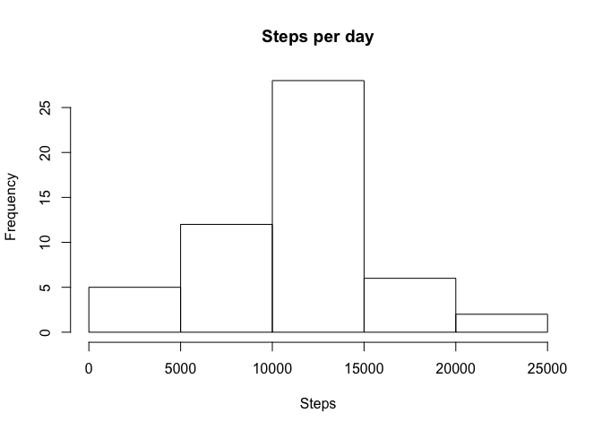
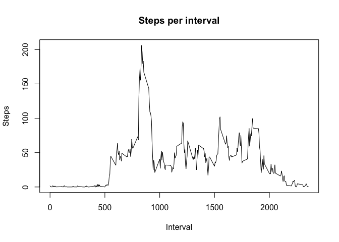
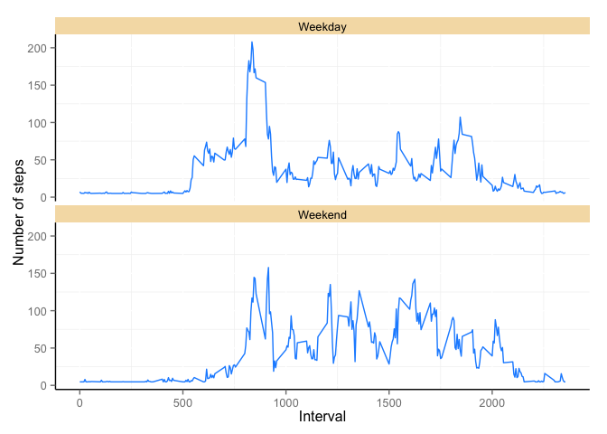

# Reproducible Research: Peer Assessment 1


## Loading and preprocessing the data

```r
unzip("activity.zip")
activity <- read.csv("./activity.csv")
```


## What is mean total number of steps taken per day?

```r
data <- na.omit(activity)
stepsByDay <- aggregate(steps ~ date, data=data, FUN=sum)
hist(stepsByDay$steps, main="Steps per day", xlab="Steps")
```

 

```r
mean(stepsByDay$steps)
```

```
## [1] 10766.19
```

```r
median(stepsByDay$steps)
```

```
## [1] 10765
```

## What is the average daily activity pattern?

```r
stepsByInterval <- aggregate(steps ~ interval, data=data, FUN=mean)
plot(stepsByInterval$interval, stepsByInterval$steps, main="Steps per interval", type="l", xlab="Interval", ylab="Steps")
```

 

5-minute interval with maximum number of steps

```r
stepsByInterval$interval[stepsByInterval$steps == max(stepsByInterval$steps)]
```

```
## [1] 835
```

## Imputing missing values

```r
na <- is.na(activity$steps)
nrow(activity[na,])
```

```
## [1] 2304
```

```r
newData <- activity
```

Devise a strategy for filling in all of the missing values in the dataset. For this example, I use the mean of all the steps.

```r
newData$steps[is.na(newData$steps)] <- mean(data$steps)
stepsByDay <- aggregate(steps ~ date, data=newData, FUN=sum)
hist(stepsByDay$steps, main="Steps per day", xlab="Steps")
```

 

```r
mean(stepsByDay$steps)
```

```
## [1] 10766.19
```

```r
median(stepsByDay$steps)
```

```
## [1] 10766.19
```

## Are there differences in activity patterns between weekdays and weekends?

```r
newData$typeDay[weekdays(as.Date(newData$date))%in% c("Saturday", "Sunday")] <- "Weekend"
newData$typeDay[!weekdays(as.Date(newData$date))%in% c("Saturday", "Sunday")] <- "Weekday"
newData$typeDay <- as.factor(newData$typeDay)
stepByInterval <- aggregate(steps ~ interval + typeDay, data=newData, FUN=mean)
library(ggplot2)
ggplot(stepByInterval, aes(x=interval, y=steps, group=1)) + geom_line(colour="dodgerblue") + facet_wrap(~ typeDay, ncol=1) + labs(x = "Interval", y = "Number of steps") + theme(panel.background = element_blank(), axis.line = element_line(colour = "black"), strip.background = element_rect(fill="wheat"))
```

 
